# AEB Project

MATLAB/Simulink와 Stateflow를 이용해 AEB(Autonomous Emergency Braking) 시스템을 구현한 프로젝트다.

처음부터 제동 로직을 한 번에 완성하기보다 차량 모델 → TTC 계산 → 위험 단계 판단 → 실제 제동 연결 → 다중 시나리오 검증 → 결과 자동화 순서로 단계별로 구현하고 검증했다.

---

## 1. 프로젝트 결과

최종적으로 3개의 대표 시나리오를 구성했고, 모든 시나리오에서 충돌을 회피했다.

| 시나리오 | Target 속도 | Ego 속도 범위 | 최대 감속 | 최소 상대거리 | 충돌 |
|---|---:|---:|---:|---:|---|
| 정지 차량 접근 | 0 m/s | 0 ~ 20 m/s | -6.0 m/s² | **11.097 m** | **NO** |
| 저속 선행차 접근 | 10 m/s | 0 ~ 25 m/s | -6.0 m/s² | **11.049 m** | **NO** |
| 선행차 급제동 | 5 ~ 22 m/s | 0 ~ 22 m/s | -6.0 m/s² | **11.659 m** | **NO** |

세 시나리오 모두 Stateflow에서 다음 네 가지 모드가 정상적으로 발생했다.

```text
NORMAL
WARNING
PARTIAL_BRAKE
FULL_BRAKE
```

---

## 2. 개발 환경

- MATLAB
- Simulink
- Stateflow
- Git / GitHub
- macOS

---

## 3. 프로젝트 구조

```text
06_AEB_Project/
├── model/
│   ├── AEB_Project.slx
│   └── init_AEB.m
│
├── scripts/
│   └── run_AEB_final.m
│
├── images/
│   ├── stationary_target_speed.png
│   ├── stationary_target_distance.png
│   ├── stationary_target_ttc.png
│   ├── stationary_target_braking.png
│   ├── stationary_target_mode.png
│   ├── slow_target_speed.png
│   ├── slow_target_distance.png
│   ├── slow_target_ttc.png
│   ├── slow_target_braking.png
│   ├── slow_target_mode.png
│   ├── hard_braking_speed.png
│   ├── hard_braking_distance.png
│   ├── hard_braking_ttc.png
│   ├── hard_braking_braking.png
│   ├── hard_braking_mode.png
│   └── aeb_scenario_comparison.png
│
├── results/
│   ├── stationary_target_metrics.csv
│   ├── stationary_target_mode_transitions.csv
│   ├── slow_target_metrics.csv
│   ├── slow_target_mode_transitions.csv
│   ├── hard_braking_metrics.csv
│   ├── hard_braking_mode_transitions.csv
│   └── all_scenarios_metrics.csv
│
└── README.md
```

MAT 파일은 시뮬레이션 원본 데이터 확인용으로 생성하지만 Git에는 올리지 않도록 관리한다.

---

## 4. 전체 시스템 구조

AEB 시스템은 크게 다음 순서로 구성했다.

```text
Target Vehicle
      │
      ├── v_target
      └── x_target
             │
             ▼
        Relative Distance
        d_rel = x_target - x_ego
             │
             ├──────────────┐
             │              │
             ▼              │
       Closing Speed        │
       v_ego - v_target     │
             │              │
             ▼              │
       TTC Calculation      │
             │              │
             ▼              │
       Stateflow AEB Logic ◀┘
             │
          aeb_mode
             ▼
       Brake Command Logic
             │
          a_cmd_aeb
             ▼
         Ego Vehicle
             │
        ┌────┴────┐
        ▼         ▼
      v_ego      x_ego
```

---

# Phase 1. 차량 모델 및 Open-loop 검증

## 5. Target Vehicle

Target Vehicle은 입력 속도를 적분해서 위치를 계산한다.

```text
v_target_cmd
      │
      ├────────────→ v_target
      │
      ▼
  Integrator
IC = x_target0
      │
      ▼
   x_target
```

관계식:

```text
dx_target / dt = v_target
```

---

## 6. Ego Vehicle

Ego Vehicle은 가속도 명령을 입력받아 속도와 위치를 계산한다.

```text
a_cmd
  │
  ▼
Saturation
  │
  ▼
Speed Integrator
  │
  ├────────────→ v_ego
  │
  ▼
Position Integrator
  │
  ▼
x_ego
```

관계식:

```text
dv_ego / dt = a_cmd
dx_ego / dt = v_ego
```

Speed Integrator의 Lower Limit은 `0 m/s`로 설정해서 차량 속도가 음수가 되는 것을 방지했다.

---

## 7. 상대거리와 Closing Speed

상대거리:

```text
d_rel = x_target - x_ego
```

Closing Speed:

```text
v_closing = v_ego - v_target
```

해석:

```text
v_closing > 0  → Ego가 Target에 접근
v_closing = 0  → 상대거리 변화 없음
v_closing < 0  → 두 차량 사이 거리가 증가
```

---

## 8. Open-loop 기준 검증

초기 조건:

```matlab
v_ego0    = 20;
x_ego0    = 0;

v_target0 = 0;
x_target0 = 100;
```

이론적인 충돌 시간은:

```text
100 m / 20 m/s = 5 s
```

실제 Simulink 결과:

```text
Target speed range: 0.000 ~ 0.000 m/s
Ego speed range: 20.000 ~ 20.000 m/s
Closing speed range: 20.000 ~ 20.000 m/s
Relative distance range: -60.000 ~ 100.000 m
Open-loop collision: YES
Collision time: 5.000 s
```

이론값과 시뮬레이션 값이 동일하게 나오는 것을 확인했다.

이 충돌 결과는 오류가 아니라 AEB 적용 전 기준값으로 사용했다.

---

# Phase 2. TTC 계산

## 9. TTC 정의

충돌 위험 판단을 위해 TTC(Time To Collision)를 계산했다.

```text
TTC = d_rel / v_closing
```

MATLAB Function:

```matlab
function TTC = calculateTTC(d_rel, v_closing)
%#codegen

if d_rel <= 0
    TTC = 0;

elseif v_closing > 0.1
    TTC = d_rel / v_closing;

else
    TTC = 99;
end
```

Target에 접근하지 않는 경우는 `TTC = 99`로 처리했다.

---

## 10. TTC 임계값

초기 AEB 기준은 다음과 같이 설정했다.

```matlab
TTC_warning = 4.0;
TTC_partial = 3.0;
TTC_full    = 2.0;

d_full = 15.0;
```

Open-loop에서는 TTC가 다음과 같이 감소한다.

| 시간 | 상대거리 | TTC |
|---:|---:|---:|
| 0 s | 100 m | 5 s |
| 1 s | 80 m | 4 s |
| 2 s | 60 m | 3 s |
| 3 s | 40 m | 2 s |
| 4 s | 20 m | 1 s |
| 5 s | 0 m | 0 s |

---

# Phase 3. Stateflow 위험 단계 판단

## 11. AEB 상태

Stateflow에서는 총 4개의 상태를 사용했다.

| 상태 | aeb_mode |
|---|---:|
| NORMAL | 1 |
| WARNING | 2 |
| PARTIAL_BRAKE | 3 |
| FULL_BRAKE | 4 |

각 State에서 출력값을 직접 설정했다.

```text
NORMAL
entry:
aeb_mode = 1;
```

```text
WARNING
entry:
aeb_mode = 2;
```

```text
PARTIAL_BRAKE
entry:
aeb_mode = 3;
```

```text
FULL_BRAKE
entry:
aeb_mode = 4;
```

---

## 12. 위험 증가 Transition

```text
NORMAL → WARNING
[TTC <= TTC_warning]
```

```text
WARNING → PARTIAL_BRAKE
[TTC <= TTC_partial]
```

```text
PARTIAL_BRAKE → FULL_BRAKE
[TTC <= TTC_full || d_rel <= d_full]
```

급격한 위험 상황에서 중간 단계를 모두 거치지 않아도 되도록 직접 전환도 추가했다.

```text
NORMAL → PARTIAL_BRAKE
NORMAL → FULL_BRAKE
WARNING → FULL_BRAKE
```

동시에 여러 조건이 참일 경우 가장 위험한 상태를 우선하도록 Transition Priority를 설정했다.

---

# Phase 4. 실제 제동 연결

## 13. 제동 명령

각 AEB 모드에 따른 제동 명령은 다음과 같다.

```text
NORMAL         →  0.0 m/s²
WARNING        →  0.0 m/s²
PARTIAL_BRAKE  → -3.0 m/s²
FULL_BRAKE     → -6.0 m/s²
```

최종적으로 Stateflow 출력이 Ego Vehicle 가속도 입력까지 연결되면서 Closed-loop AEB 시스템을 구성했다.

---

## 14. Multiport Switch 오류와 해결

처음에는 `Multiport Switch`로 `aeb_mode`를 제동 명령으로 변환하려고 했다.

하지만 시뮬레이션 시작 시 다음 오류가 발생했다.

```text
Multiport Switch 제어 포트 값 '0'이
'1'과 '4' 사이에 있지 않습니다.
```

Stateflow의 초기 상태를 NORMAL로 설정하고 `aeb_mode` 초기값도 `1`로 설정했지만, 시뮬레이션 초기 계산 과정에서 순간적으로 `0`이 전달되는 문제가 반복됐다.

다음 방법도 시도했다.

```text
aeb_mode Initial Value = 1
Stateflow Default Transition 확인
Saturation [1, 4] 추가
```

하지만 동일한 문제가 계속 발생했다.

최종적으로 Multiport Switch를 제거하고 MATLAB Function 기반으로 바꿨다.

```matlab
function a_cmd_aeb = brakeCommand(aeb_mode)
%#codegen

switch round(aeb_mode)

    case 1
        a_cmd_aeb = 0.0;

    case 2
        a_cmd_aeb = 0.0;

    case 3
        a_cmd_aeb = -3.0;

    case 4
        a_cmd_aeb = -6.0;

    otherwise
        a_cmd_aeb = 0.0;
end
```

`otherwise`를 추가해서 초기화 순간이나 비정상 모드가 들어와도 안전하게 `0 m/s²`를 출력하도록 했다.

이 방식으로 구조를 바꾼 뒤 초기값 관련 오류를 제거했다.

---

# Phase 5. 복귀 로직과 다중 시나리오

## 15. 히스테리시스

위험이 줄었을 때 바로 이전 상태로 복귀할 수 있도록 Release Threshold를 추가했다.

```matlab
TTC_warning_release = 5.0;
TTC_partial_release = 4.0;
TTC_full_release    = 3.0;

d_full_release = 20.0;
```

진입 조건과 해제 조건을 다르게 두어 경계값 주변에서 상태가 반복적으로 바뀌는 현상을 줄였다.

---

## 16. 시나리오 구성

### Scenario 1 - 정지 차량

```text
Ego 초기속도    : 20 m/s
Target 속도     : 0 m/s
초기 상대거리   : 100 m
```

결과:

```text
Modes observed: 1 2 3 4
Target speed range: 0.000 ~ 0.000 m/s
Ego speed range: 0.000 ~ 20.000 m/s
Acceleration range: -6.000 ~ 0.000 m/s²
Minimum relative distance: 11.097 m
Collision: NO
```

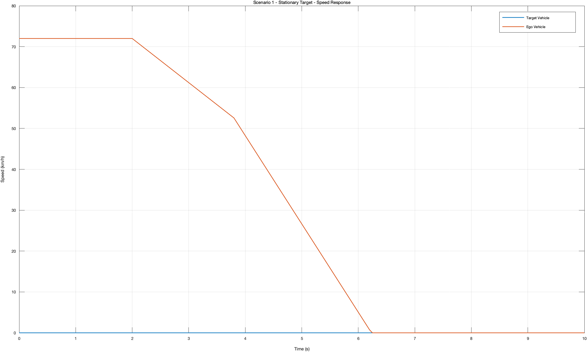

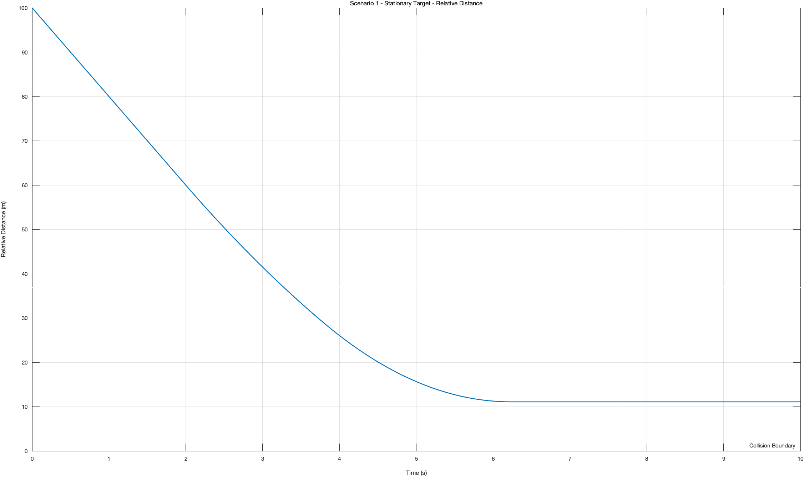

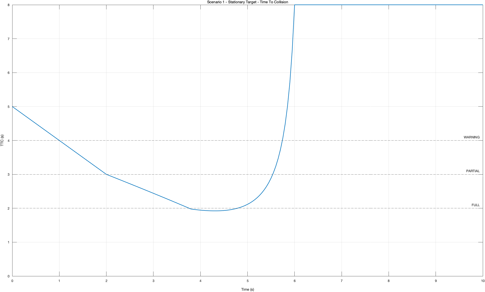

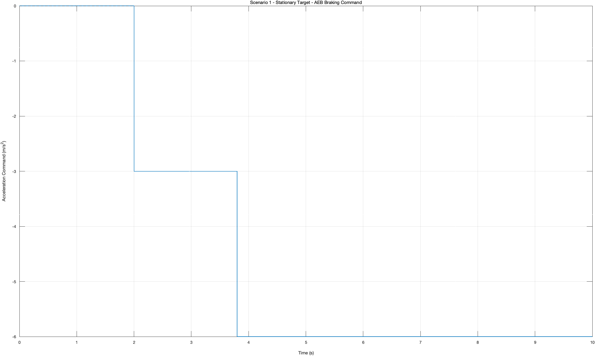

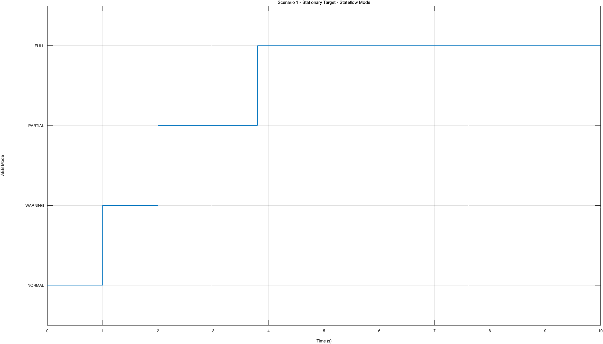

---

### Scenario 2 - 저속 선행차

```text
Ego 초기속도    : 25 m/s
Target 속도     : 10 m/s
초기 상대거리   : 80 m
```

결과:

```text
Modes observed: 1 2 3 4
Target speed range: 10.000 ~ 10.000 m/s
Ego speed range: 0.000 ~ 25.000 m/s
Acceleration range: -6.000 ~ 0.000 m/s²
Minimum relative distance: 11.049 m
Collision: NO
```

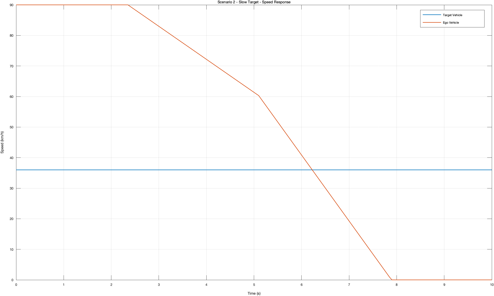

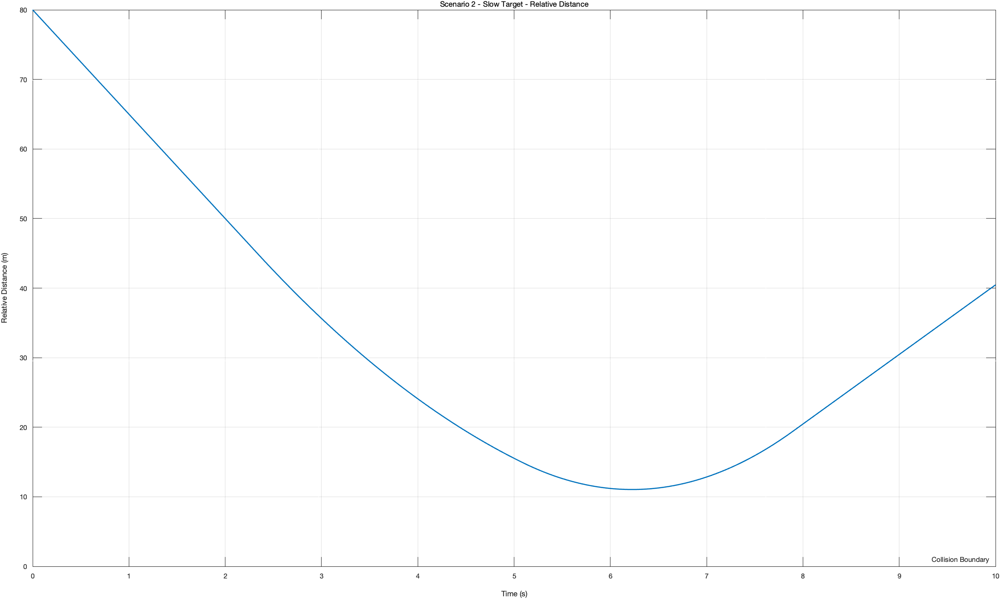

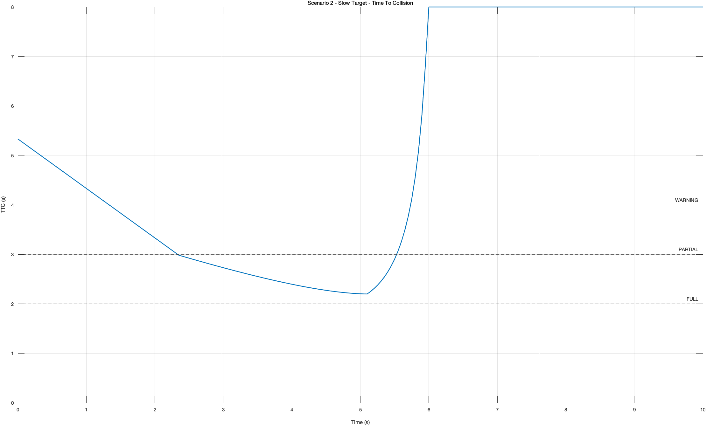

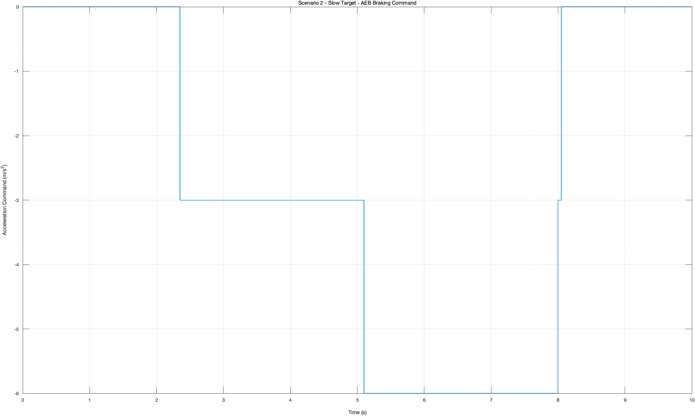

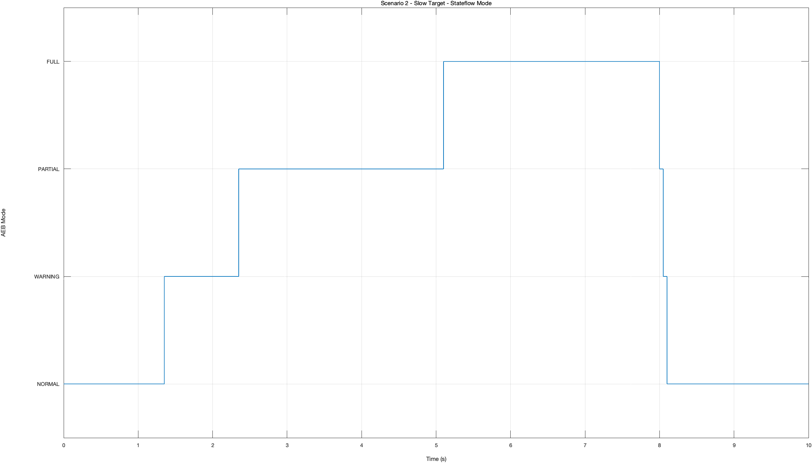

---

### Scenario 3 - 선행차 급제동

```text
Ego 초기속도    : 22 m/s
Target 초기속도 : 22 m/s
Target 최저속도 : 5 m/s
초기 상대거리   : 65 m
```

Target Vehicle은 2초부터 감속을 시작하고 3초에 `5 m/s`까지 감소하도록 구성했다.

결과:

```text
Modes observed: 1 2 3 4
Target speed range: 5.000 ~ 22.000 m/s
Ego speed range: 0.000 ~ 22.000 m/s
Acceleration range: -6.000 ~ 0.000 m/s²
Minimum relative distance: 11.659 m
Collision: NO
```

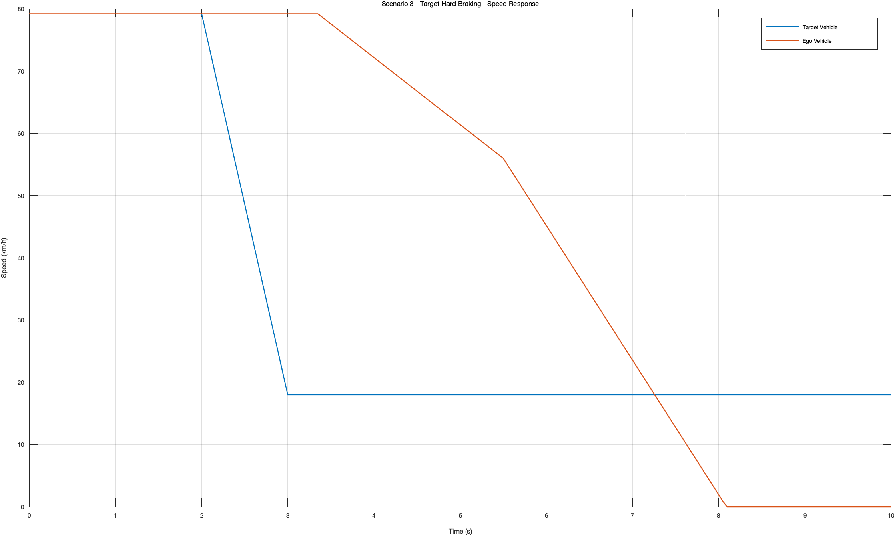

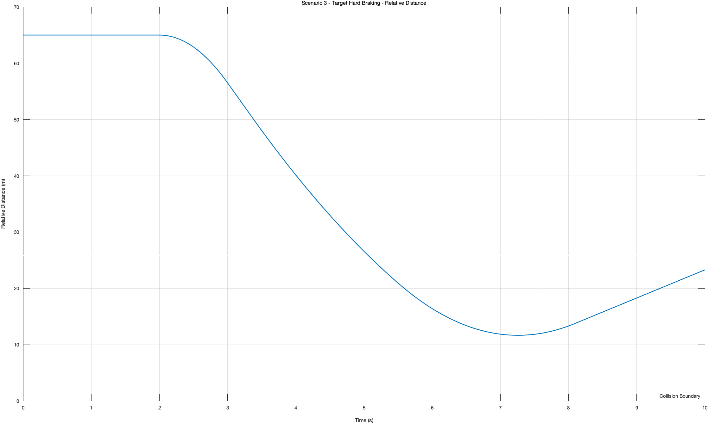

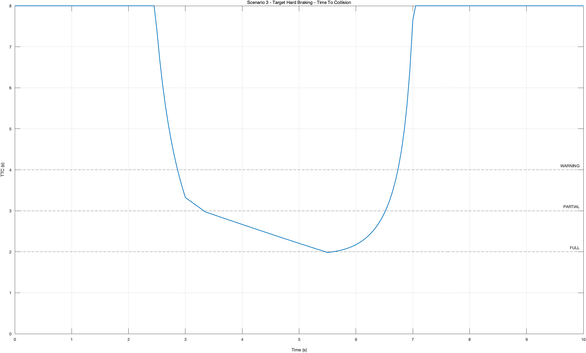

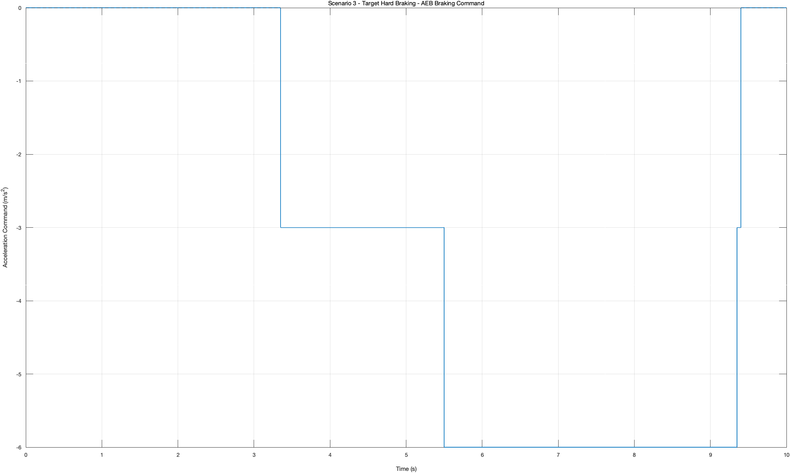

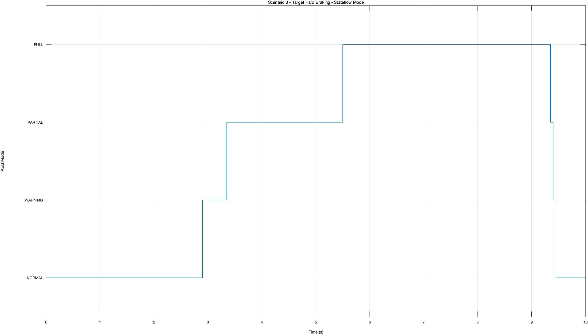

---

## 17. 시나리오 비교

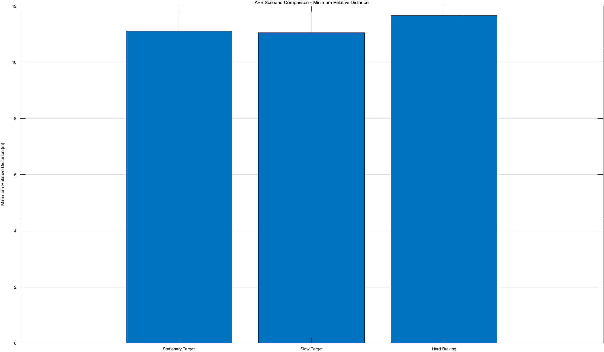

세 시나리오 모두 최소 약 `11 m` 이상의 상대거리를 남기면서 충돌을 회피했다.

특히 Scenario 3에서는 초기에는 Ego와 Target 속도가 동일해서 TTC가 `99`로 유지되지만, Target이 급감속한 뒤 Closing Speed가 증가하면서 TTC가 감소하고 AEB가 순차적으로 개입하는 것을 확인했다.

---

# Phase 6. 결과 자동화

## 18. run_AEB_final.m

최종 단계에서는 매번 시나리오를 수동으로 변경하지 않도록 `run_AEB_final.m`을 작성했다.

스크립트를 한 번 실행하면 다음 작업을 자동으로 수행한다.

```text
Scenario 1 실행
→ 결과 분석
→ PNG 저장
→ CSV 저장

Scenario 2 실행
→ 결과 분석
→ PNG 저장
→ CSV 저장

Scenario 3 실행
→ 결과 분석
→ PNG 저장
→ CSV 저장

→ 전체 Scenario 요약 CSV 생성
→ 비교 그래프 생성
```

실행:

```matlab
cd("/Users/jun_mac/Documents/Project_First_Job/06_AEB_Project")

run("scripts/run_AEB_final.m");
```

정상 완료 시:

```text
AEB FINAL EXPORT COMPLETED
```

가 출력된다.

---

## 19. 자동 저장되는 정량 지표

`all_scenarios_metrics.csv`에는 다음 항목을 저장한다.

```text
Scenario
ScenarioName
MinimumTargetSpeed_mps
MaximumTargetSpeed_mps
MinimumEgoSpeed_mps
MaximumEgoSpeed_mps
MinimumClosingSpeed_mps
MaximumClosingSpeed_mps
MinimumRelativeDistance_m
MinimumTTC_s
MinimumAcceleration_mps2
MaximumAcceleration_mps2
WarningEntryTime_s
PartialBrakeEntryTime_s
FullBrakeEntryTime_s
NormalDuration_s
WarningDuration_s
PartialBrakeDuration_s
FullBrakeDuration_s
StopTime_s
StoppingDistance_m
RelativeDistanceAtStop_m
CollisionOccurred
FirstCollisionTime_s
ImpactSpeed_mps
```

---

# 20. 주요 시행착오

프로젝트를 진행하면서 다음 문제들을 직접 확인하고 수정했다.

### 1) Open-loop 충돌 검증

처음부터 제어기를 넣지 않고 차량 모델만 먼저 검증했다.  
이론적인 충돌시간과 실제 시뮬레이션 결과가 동일한지 확인한 뒤 다음 단계로 넘어갔다.

### 2) TTC 계산 예외 처리

Closing Speed가 0 이하인 상황에서 단순 나눗셈을 하면 의미 없는 TTC가 발생할 수 있기 때문에 `TTC = 99`를 별도 값으로 사용했다.

### 3) Stateflow Transition 우선순위

TTC가 매우 낮을 경우 WARNING, PARTIAL, FULL 조건이 동시에 참이 될 수 있었다.  
가장 위험한 FULL_BRAKE 조건을 우선하도록 Transition Priority를 설정했다.

### 4) Multiport Switch 초기 입력 오류

시뮬레이션 초기 `aeb_mode = 0` 문제 때문에 Multiport Switch가 정상 동작하지 않았다.  
단순히 오류 메시지를 무시하지 않고 MATLAB Function 기반 Brake Command로 구조를 변경했다.

### 5) 시나리오 자동화

초기에는 `scenario_case`를 직접 바꿔가며 시뮬레이션했지만, 최종적으로 세 시나리오를 한 번에 실행하고 결과를 저장하는 자동화 스크립트를 작성했다.

---

# 21. 프로젝트 한계점

현재 모델은 AEB의 충돌 회피 및 비상 제동 기능에 초점을 맞췄다.

따라서 다음 기능은 포함하지 않았다.

- 제동 해제 후 목표속도로 재가속
- ACC와 AEB의 통합 제어
- 실제 차량의 타이어/노면 마찰 모델
- 센서 노이즈
- 레이더/카메라 인식 지연
- 차량 질량 변화
- 제동 액추에이터의 상세 동특성
- 실제 Euro NCAP 시나리오 조건

특히 현재 모델에서는 AEB 작동 후 Ego 차량이 정지하면 자동으로 재출발하지 않는다.

이 부분은 다음 Vehicle Control 프로젝트에서 ACC/AEB를 통합하면서 개선할 예정이다.

---

# 22. 프로젝트를 통해 배운 점

이번 프로젝트를 통해 단순히 Simulink 블록을 연결하는 것보다 다음 과정이 중요하다는 것을 확인했다.

```text
모델 구성
→ 기준 시나리오 검증
→ 위험도 계산
→ 상태 기반 제어
→ 실제 제어 입력 연결
→ 오류 원인 분석
→ 다중 시나리오 검증
→ 결과 자동화
```

특히 제어 로직이 정상적으로 동작하는 것과 실제 차량 모델의 충돌 회피 성능이 좋은 것은 별개의 문제이기 때문에, 내부 신호와 최종 성능을 함께 확인하는 방식으로 프로젝트를 진행했다.

---

# 23. 최종 결과

```text
Scenario 1 - 정지 차량
Collision: NO
Minimum Relative Distance: 11.097 m

Scenario 2 - 저속 선행차
Collision: NO
Minimum Relative Distance: 11.049 m

Scenario 3 - 선행차 급제동
Collision: NO
Minimum Relative Distance: 11.659 m
```

세 시나리오 모두 충돌을 회피했고, TTC 기반 위험 판단 → Stateflow 모드 전환 → 단계별 제동 → 정량 결과 저장까지 하나의 AEB 시스템으로 구성했다.
